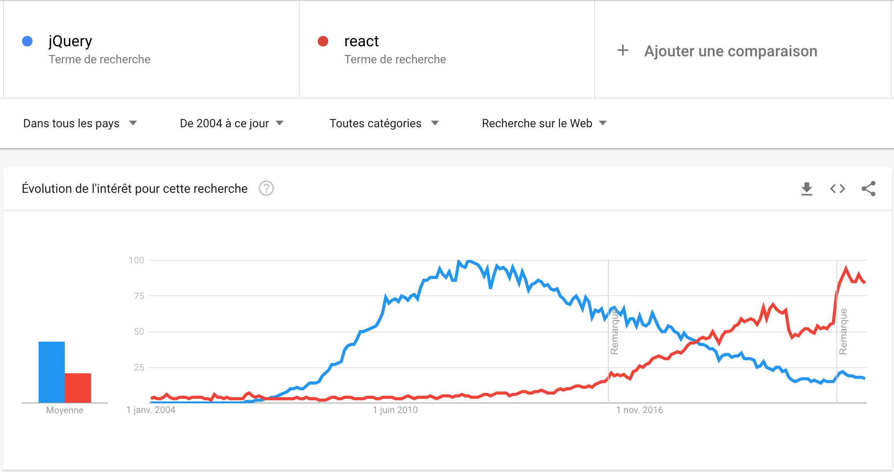

# Origines

## WTF is [React](https://reactjs.org/) ?

[React](https://reactjs.org/) est ce qu'on appelle un **framework** front-end. Il est basé sur une architecture par composants.

Un framework est une librairie proposant une philosophie de développement dédiée à un sujet particulier, et tout un outillage permettant de la mettre en oeuvre.

Il est **développé et maintenu par Facebook** depuis 2011, et a été rendu **open-source** en 2013.

C'est aujourd'hui un **standard du développement web client**, aux côtés d'[Angular](https://angular.io/) (Google) et de [Vue](https://vuejs.org/).

React est aujourd'hui plus populaire que [jQuery](https://jquery.com/).

## L'évangile selon St. Brendan

Au 10ème jour, [Dieu créa Javascript](https://fr.wikipedia.org/wiki/Brendan_Eich), pour pouvoir manipuler le [DOM](https://fr.wikipedia.org/wiki/Document_Object_Model) programmatiquement.

- JS vanille (1995)

Mais comme c'était un peu le bordel, des initiatives offrant des utilitaires plus pratiques sont apparues au fur et à mesure.

La populaire d'entre elles est jQuery.

- [jQuery](https://jquery.com/) (2006)

jQuery offre des outils utilitaires sur plein de fronts, dépassant même la simple manipulation du DOM, mais ne propose pas de réelle réflexion sur comment architecturer une application web.

C'est ce que vont proposer des projets tels que Angular, Backbone, ou Ember.

- [Angular 1](https://angularjs.org/) (2009)
- [Backbone](https://backbonejs.org/) (2010)
- [Ember 1](https://emberjs.com/) (2011)

En 2011 une proposition de standard émerge pour apporter la notion de **modèle de composants** au web, permettant de créer des balises HTML personnalisées et réutilisables. C'est ce qu'on appelle les Web Components.

- [Web components specification](https://fr.wikipedia.org/wiki/Composants_web) (2011)

Cette proposition n'a pas vraiment pris, et est toujours en cours de standardisation. Mais elle a inspiré de nouvelles initiatives à proposer des librairies de modèle de composants.

Celle qui a émergé comme la nouvelle référence du développement web front-end est React.

- [React](https://reactjs.org/) (2013)

Depuis, plusieurs projets similaires sont apparus, comme Vue, ou ont évolués. Tous reprennent tout ou partie des grands principes de React.

- [Vue](https://vuejs.org/) (2014)
- Ember 2 (2015)
- [Angular 2](https://angular.io/) (2016)

Quelques uns de ces projets commencent même à remettre en cause certains piliers de la philosophie React. Svelte est le plus connu d'entre eux.

- [Svelte](https://svelte.dev/) (2016)

## Pourquoi React existe ?

Facebook naît en 2004, et se développe rapidement.

À l'époque, le web était bien différent d'aujourd'hui, et l'importance des données n'était pas encore évidente pour tout le monde.

Facebook, comme Google, fait partie de ces projets qui ont compris l'intérêt des données, et a basé son essence dessus. À tel point que Facebook est probablement au début des années 2010 l'application affichant le plus données pour un parc d'utilisateurs massif jamais dévelopée.

La complexité des données à afficher ainsi que les besoins fréquents de maintenance liés au volume d'utilisateurs mettent en valeur le fait que les pratiques de développement de l'époque ne sont pas adaptées à ce nouveau contexte.

Les problèmes que les équipes de Facebook identifient sont:

- l'architecture de l'applications est complexe à comprendre (et à maintenir)
- le parcours des données au sein de l'application est complexe à orchestrer (et à maintenir)
- les performances d'exécution de l'application sont difficiles à maitriser (et à maintenir)
- le code est de plus en plus complexe à écrire (et à maintenir)

React a été développé pour répondre à ces problématiques.

## à suivre: [Principes](./2_principes.md)
