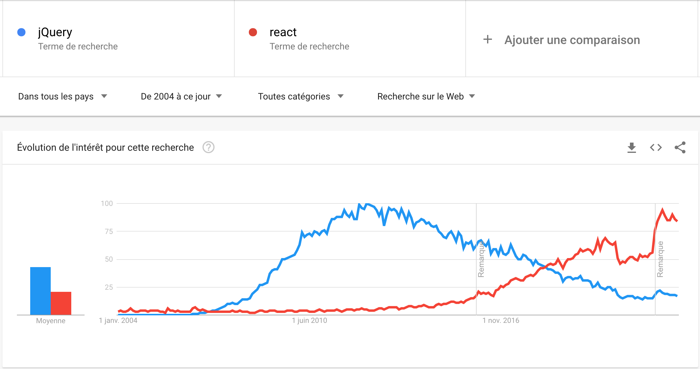

# WTF is [React](https://reactjs.org/) ?

[React](https://reactjs.org/) est ce qu'on appelle un **framework** front-end. Il est basé sur une architecture par composants.

Un framework est une librairie proposant une philosophie de développement dédiée à un sujet particulier, et tout un outillage permettant de la mettre en oeuvre.

React est **développé et maintenu par Facebook** depuis 2011, et a été rendu **open-source** en 2013.

C'est aujourd'hui un **standard du développement web client**, aux côtés d'[Angular](https://angular.io/) (Google) et de [Vue](https://vuejs.org/).

Il permet de **définir des UI via du code déclaratif** (*je déclare quelle tête doit avoir mon UI*) plutôt que via du code impératif (*je décris la logique de laquelle va découler mon UI*).

React est aujourd'hui plus populaire que [jQuery](https://jquery.com/).

## Pourquoi React existe ?

Facebook naît en 2004, et se développe rapidement.

À l'époque, le web était bien différent d'aujourd'hui, et l'importance des données n'était pas encore évidente pour tout le monde.

Facebook, comme Google, fait partie de ces projets qui ont compris l'intérêt des données, et a basé son essence dessus. À tel point que Facebook est probablement au début des années 2010 l'application affichant le plus données pour un parc d'utilisateurs massif jamais dévelopée.

**La complexité des données à afficher ainsi que les besoins fréquents de maintenance** liés au volume d'utilisateurs **mettent en valeur le fait que les pratiques de développement de l'époque ne sont pas adaptées** à ce nouveau contexte.

Les problèmes que les équipes de Facebook identifient sont:

- l'architecture de l'applications est complexe à comprendre (et à maintenir)
- le parcours des données au sein de l'application est complexe à orchestrer (et à maintenir)
- les performances d'exécution de l'application sont difficiles à maitriser (et à maintenir)
- le code est de plus en plus complexe à écrire (et à maintenir)

React a été développé pour répondre à ces problématiques.

---

### à suivre: [Principes](./3_concepts.md)
