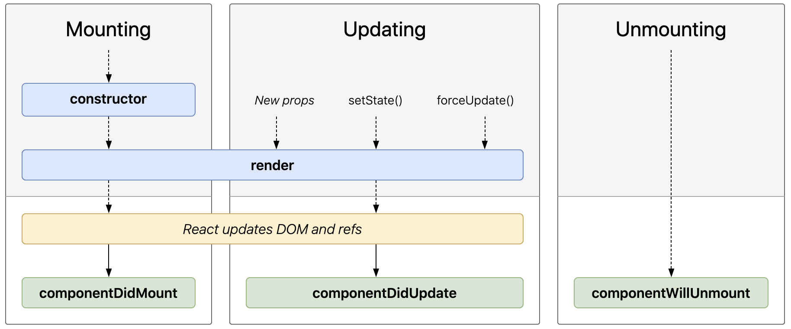

# Le cycle de vie

Les composants React ont un cycle de vie, qui permet d'intervenir à différents bien spécifiques de la vie d'une instance:

- montage
- mise à jour
- démontage

On a déjà vu 2 méthodes du cycle de vie:

- `constructor()`: pour instancier un composant
- `render()`: pour mettre à jour l'instance

Lorsqu'un composant est instancié, `constructor()` est appelé. Une instance du composant est alors initialisée, et créée.

Puis `render()` est appelée une première fois. Cela permet de _monter_ l'instance, c'est à dire l'intégrer aux DOMs (virtuels, et réels).

`componentDidMount()` est ensuite appelée, une seule fois, après le montage de l'instance.

À chaque mise à jour de l'instance (via de nouvelles `props` ou `setState()`), `render()` est de nouveau appelée, puis `componentDidUpdate()`,

Enfin, juste avant qu'une instance soit _démontée_ (retirée des DOMs), la méthode `componentWillUnmount()` est appelée.

## [`constructor()`](https://fr.reactjs.org/docs/react-component.html#constructor)

Permet de personnaliser l'instanciation un composant.

C'est la première méthode du cycle de vie et n'est appelée qu'une fois par instance.

C'est ici notamment qu'on initialise le `state` et que l'on _bind_ les méthodes personnalisées.

## [`render()`](https://fr.reactjs.org/docs/react-component.html#render)

Permet de mettre à jour un composant.

C'est la seule méthode indispensable du cycle de vie. Elle est appelée une première fois pour le montage, puis à chaque réception de nouvelles `props` ou à chaque appel de `setState()`.

## [`componentDidMount()`](https://fr.reactjs.org/docs/react-component.html#componentdidmount)

Permet de réagir au montage d'une instance.

Elle n'est exécutée qu'une fois par instance.

C'est ici notamment qu'on fait les appels au réseau pour initialiser de la donnée, ou que l'on effectue d'éventuels souscriptions.

## [`componentDidUpdate()`](https://fr.reactjs.org/docs/react-component.html#componentdidupdate)

Permet de réagir à la mise à jour d'une instance.

Elle est exécutée après chaque `render()`, à l'exception du tout premier.

On s'en sort en général pour faire des calculs sur le DOM (dimensions d'éléments par exemple), ou pour faire de nouveaux appels au réseau en fonction des nouvelles `props`/`state`.

## [`componentWillUnmount()`](https://fr.reactjs.org/docs/react-component.html#componentwillunmount)

Permet d'anticiper le démontage d'une instance.

Elle n'est exécutée qu'une seule fois par instance, juste avant qu'elle soit décrochée du DOM.

On s'en sert généralement pour se désabonner aux souscriptions faites au `componentDidMount()`, ou pour arrêter d'éventuels `interval`s.

## Exercices

1. > Aller chercher les données de tous les Pokémons en utilisant `src/utils/fetchPokemon.js`

- on n'a plus besoin d'importer la donnée depuis le json
- le composant racine n'a plus besoin de la `props` `data`
- la donnée des Pokémons se trouve maintenant dans le `state`

2. > Modifier `TrainedPokemon` pour que l'experience soit incrémentée toutes les secondes

- utiliser `setInterval`
- penser à gérer le cas où le `TrainedPokemon` serait démonté

## à suivre: [`Extras`](./4_extras.md)
